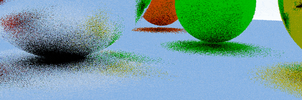
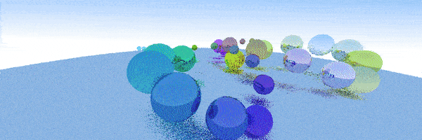

# Compute shaders : GPU ray tracing

OpenGL compute shaders exercise : real time GPU ray tracing.

<p align="center">
    
</p>

<p align="center">
    
</p>

## Description

This project was made at ArtFX - TD 4.

## Getting Started

### Dependencies

This project is using the following libraries : 

- [GLFW](https://www.glfw.org/) (Window management)
- [GLEW](http://glew.sourceforge.net/) (OpenGL Extension Wrangler)

Install them : 

```shell
$ sudo apt install libglfw3-dev libglew-dev
```

The build system is [Meson](https://mesonbuild.com/index.html).

To install Meson, do the following : 

```shell
$ sudo apt-get install python3 python3-pip python3-setuptools \
                       python3-wheel ninja-build

$ pip3 install --user meson
```

### One line command

You can do the following steps with one line : 

```shell
$ meson build && cd build && meson compile && cd .. && ./build/src/ray-tracing-cs
```

### Build

To configure the build directory, run : 

```shell
$ meson build
```

Then compile it : 

```shell
$ cd build && meson compile
```

### Execute the program

From the project folder, run the executable (for relative paths like shaders) : 

```shell
$ ./build/src/ray-tracing-cs
```

### Arguments and options

There's two scenes for now, you can specify it with a number parameter (starting at 1): 

```shell
$ ./build/src/ray-tracing-cs 2 // Second scene
```

You can also pass the resolution of the window (by default it's 1024x512 pixels): 

```shell
$ ./build/src/ray-tracing-cs 1 1920 1080
```

### Sources and documentation

- [Ray Tracing in One Weekend](https://raytracing.github.io/books/RayTracingInOneWeekend.html) by [Peter Shirley](https://github.com/petershirley)
- [Introduction aux compute shaders](https://zestedesavoir.com/tutoriels/1554/introduction-aux-compute-shaders/) by denissalem
- [It's More Fun to Compute](https://antongerdelan.net/opengl/compute.html) by [Anton Gerdelan](https://antongerdelan.net/)
